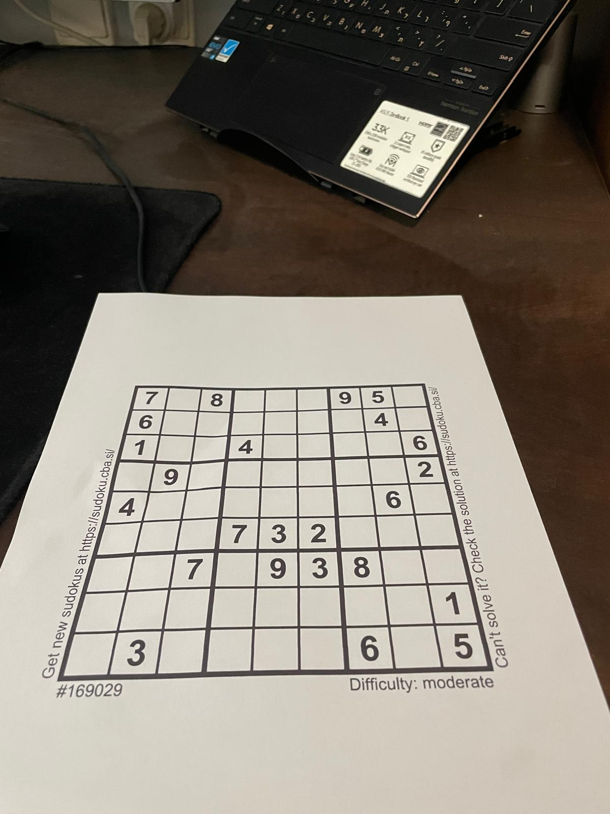
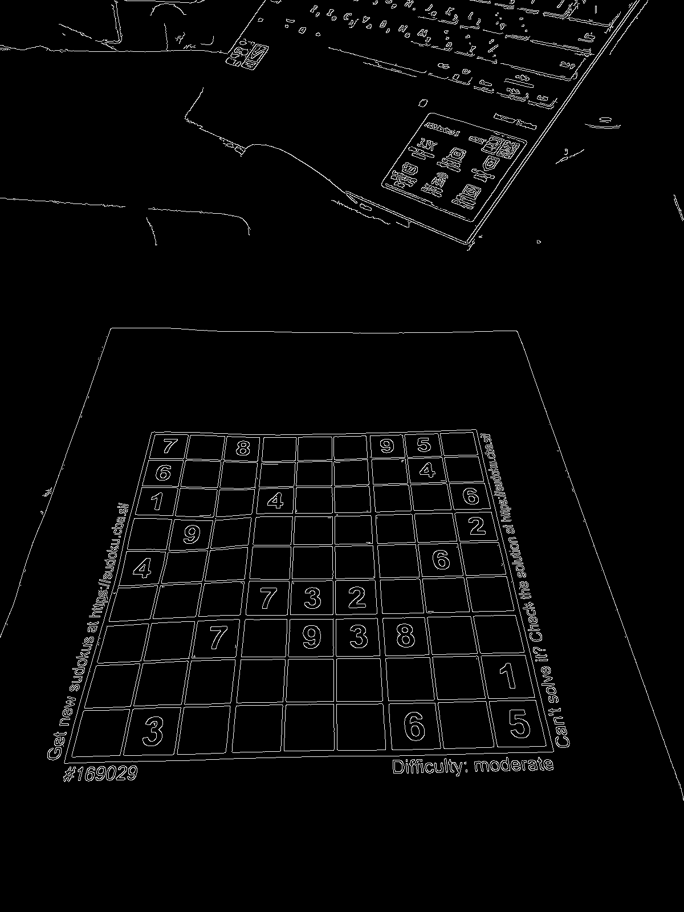
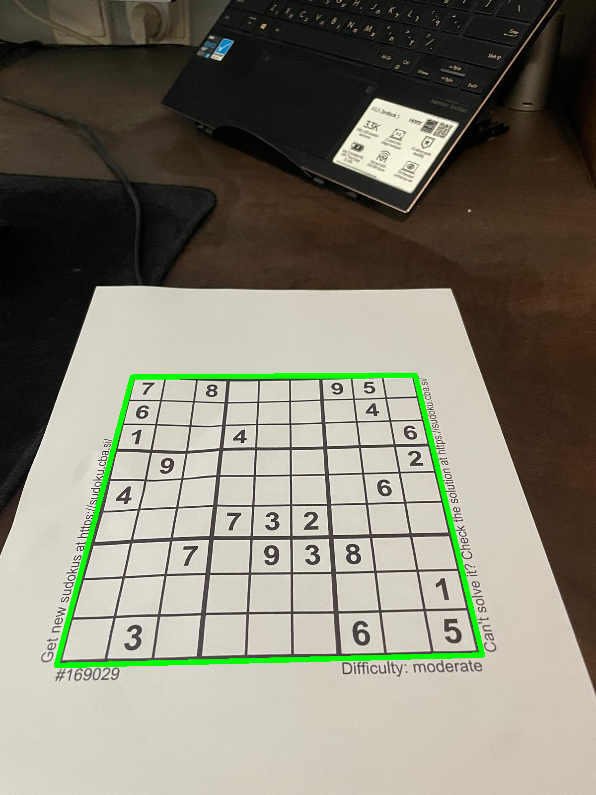

# 🧠 Sudoku Solver – Computer Vision Puzzle Solver  
_Final Project – Algorithms on Multimedia_


## 📌 Project Overview

Sudoku Solver is an end-to-end AI-based system that solves Sudoku puzzles from images. Created as a final project for the **Algorithms on Multimedia** course, this project integrates computer vision, deep learning (CNN), and classic AI search algorithms.
**Demonstration Video:** https://youtu.be/TtWKO3E_rdE
### 🔍 Key Features

- Detects and extracts the Sudoku grid from an image
- Recognizes digits using a trained CNN
- Solves the puzzle using a backtracking algorithm
- Fully interactive Django-based web interface

---

## ⚙️ Workflow

### 1. **Image Preprocessing**
- Convert uploaded image to grayscale
- Apply Gaussian blur to reduce noise

### 2. **Edge Detection & Contour Finding**
- Use Canny edge detection to identify puzzle edges
- Find the largest 4-sided contour (the Sudoku grid)

### 3. **Perspective Transformation**
- Warp the image to a clean 9×9 top-down grid

### 4. **Cell Segmentation & Digit Recognition**
- Split the grid into 81 cells
- Predict digits using a pretrained CNN (PyTorch)
- Classify blank cells as `0`

### 5. **AI Puzzle Solving**
- Solve with **backtracking** (DFS + constraint checks)
- Ensure valid rows, columns, and 3×3 blocks

### 6. **Interactive Display**
- Show original vs. solved grid
- Differentiate between original and filled-in digits
- Let users edit and verify manually

---
## ✨ Demo  
### Input images  
<p align="left">
  
</p>

### Canny Edge 
<p align="left">
  
</p>

### Find Contour
<p align="left">
  
</p>

---
## 🚀 Setup Instructions

```bash
# 1. Clone the repo
git clone https://github.com/Mshitritt/Sudoku-Solver.git
cd Sudoku-Solver

# 2. Create virtual environment
python3 -m venv venv
source venv/bin/activate  # Windows: venv\Scripts\activate

# 3. Install dependencies
pip install -r requirements.txt  # or install manually:
pip install django opencv-python torch torchvision numpy scipy Pillow

# 4. Run the Django server
python manage.py runserver
